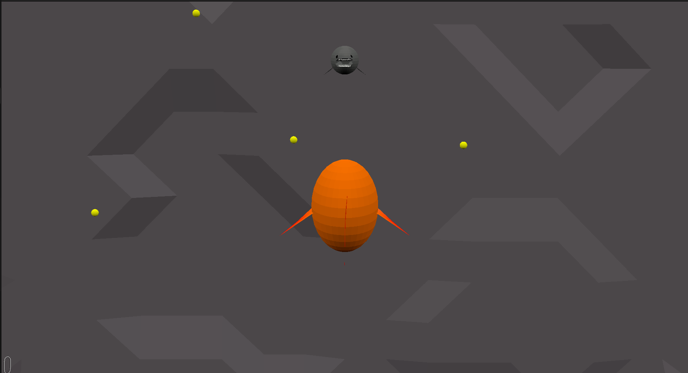

# Sushi's on the menu

Author: Matteo (mjeulin)

Design: This game is short but intense and requires perfect precision. This is also my first 3D game and first time creating 3D assets.

Screen Shot:

How To Play:

Use the WASD keys or the arrow keys to move and the mouse to look around. The goal of the game is to collect as many of the yellow balls as possible while staying away from the big shark trying to eat you. Every time a ball is picked up however, the game speeds up so stay on your toes! You can also press space to restart the game

This game was built with [NEST](NEST.md).
